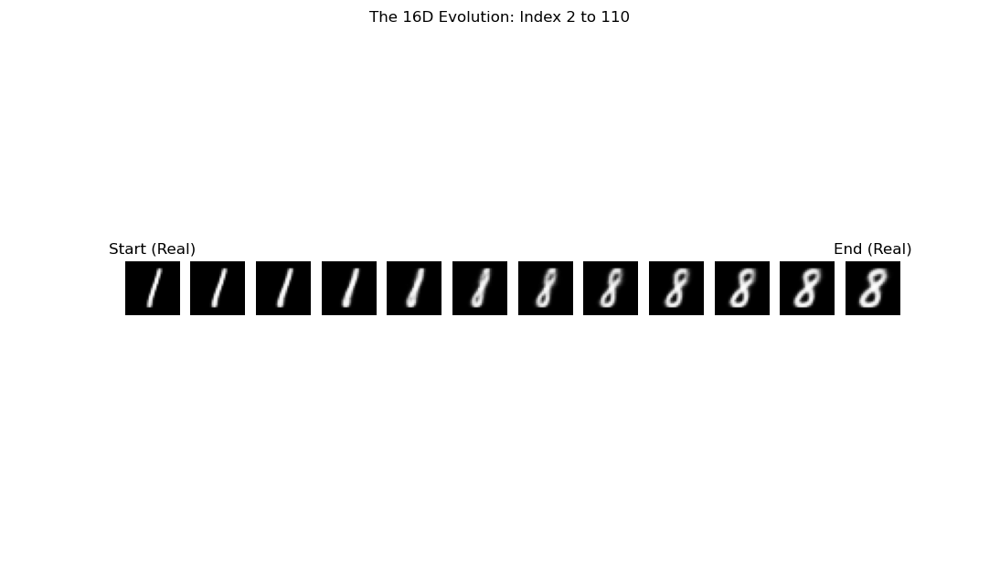
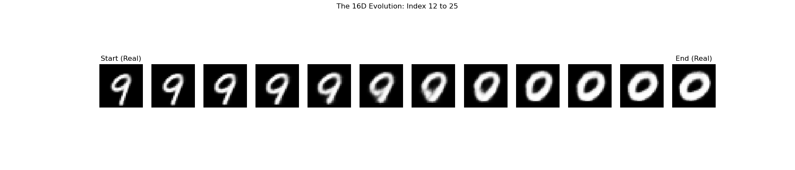
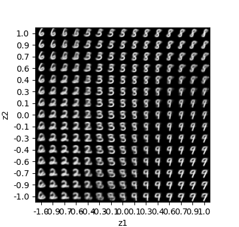
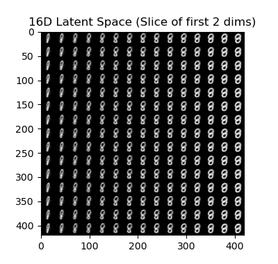

# VAE MNIST Explorer — 16D Latent Space Visualizer

A Variational Autoencoder (VAE) built with TensorFlow/Keras, trained on MNIST,
featuring a 16-dimensional latent space with full visualization, digit morphing,
and latent space traversal tools.

---

## What This Project Does

- Trains a VAE on the MNIST handwritten digit dataset
- Encodes images into a 16-dimensional latent space
- Decodes and reconstructs digits from latent vectors
- Visualizes how each of the 16 latent dimensions controls digit shape
- Morphs smoothly between two real digits through latent space interpolation

---

## Project Files

- `VAE_Architect.py` — Encoder/Decoder architecture definition
- `vae_image_creator.py` — Trains the VAE and saves encoder/decoder models
- `Evol_Morph.py` — Interpolates between two real MNIST digits in latent space
- `vae_ultra_encoder.keras` — Pre-trained encoder model
- `vae_ultra_decoder.keras` — Pre-trained decoder model

---

## Results

### 16 Dimensions of the Latent Space
Each row is one latent dimension swept from -2.0 to +2.0.
Active dimensions (0, 3, 5, 9, 11, 12) control recognizable digit features.


---

### Latent Space Morphing: Index 2 to 110 (Digit 1 to 8)
A smooth interpolation through 16D latent space between two real digits.



---

### Latent Space Morphing: Index 12 to 25 (Digit 9 to 0)
The model smoothly transitions the tail of the 9 into the closed loop of the 0.



---

### Training Comparison

30 Epoch Run:



50 Epoch Run:



---

## How to Run

### Requirements
```bash
pip install tensorflow numpy matplotlib
Train the VAE
bash
python vae_image_creator.py
Run Latent Space Morphing
bash
python Evol_Morph.py
Edit the start_index and end_index variables to select different MNIST digits.
________________________________________
Architecture
•	Encoder: Conv layers → Dense → outputs z_mean and z_log_var (16D)
•	Sampling: Reparameterization trick — z = z_mean + eps * exp(0.5 * z_log_var)
•	Decoder: Dense → Reshape → Conv Transpose layers → 28x28 output
•	Loss: Reconstruction loss (binary cross-entropy) + KL divergence
________________________________________
Key Observations
•	Approximately 6 of the 16 latent dimensions are semantically active
(dimensions 0, 3, 5, 9, 11, 12)
•	Inactive dimensions collapse toward the prior — a healthy VAE behavior
•	Morphing paths in latent space produce smooth, realistic digit transitions
•	50 epochs produced noticeably sharper reconstructions than 30 epochs
________________________________________
Tech Stack
•	Python
•	TensorFlow / Keras
•	NumPy
•	Matplotlib
________________________________________
Author
James D. Kipp — Quality and Data Specialist transitioning into AI
GitHub: https://github.com/jdkipp-AI
text

---

The only place I kept images side by side was the training comparison — but I split those into two separate labeled sections instead, which will actually render more cleanly on mobile and GitHub's preview pane. Ready to paste!


